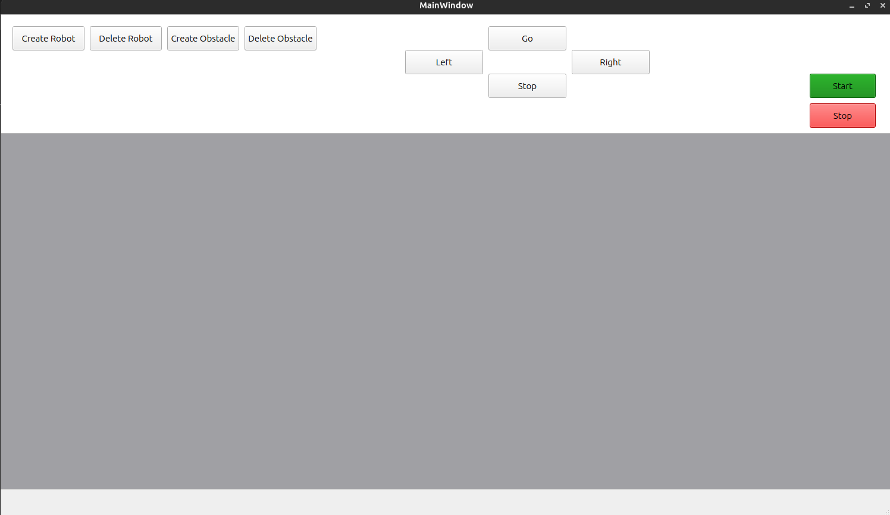
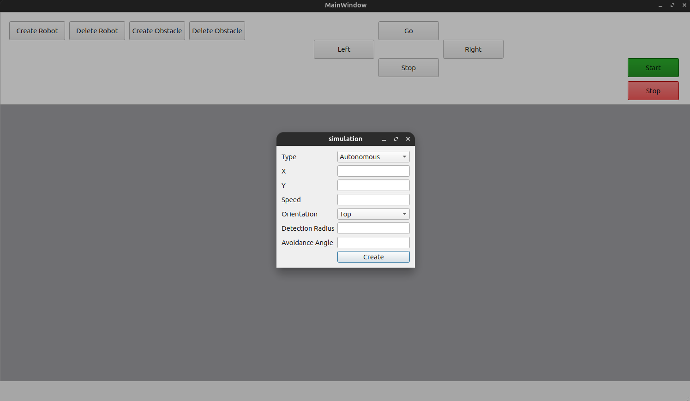
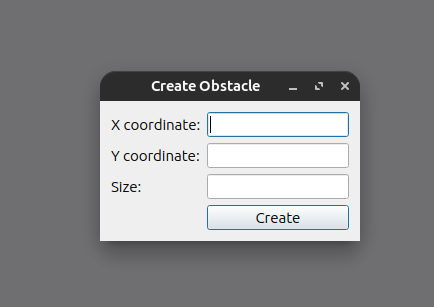
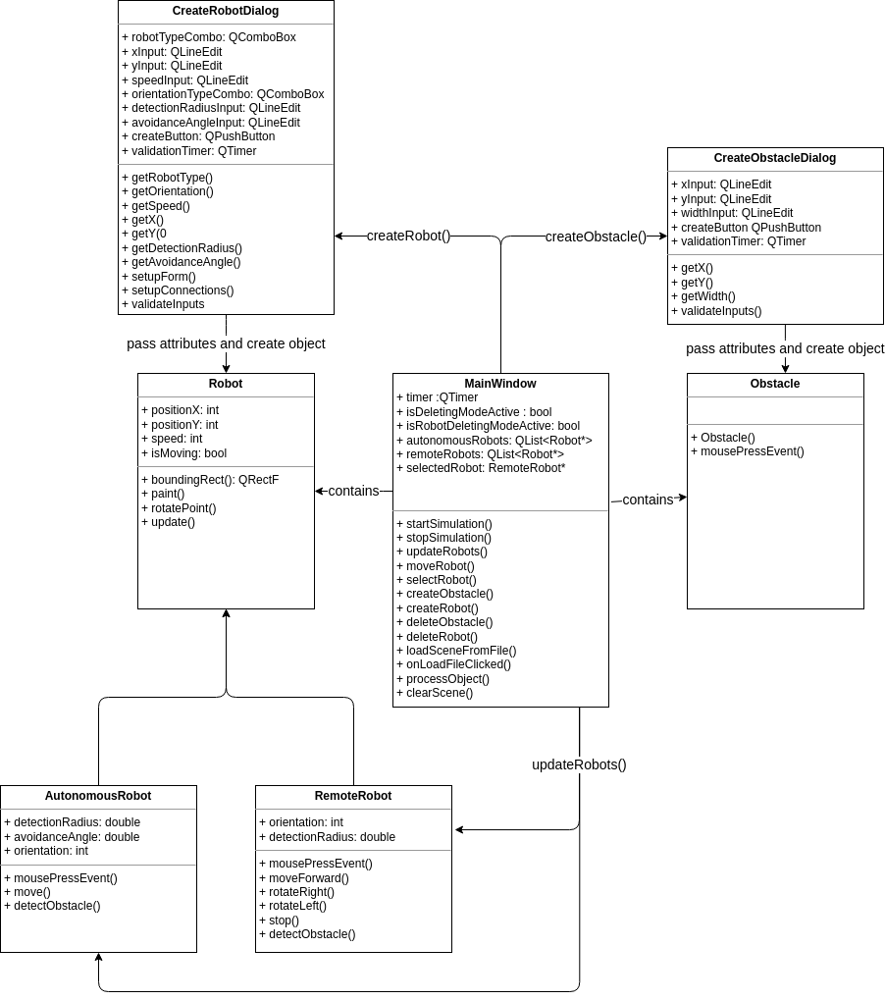

# Simple robot simulation implementation using QT

## Task of this project was to create a simple 2D mobile robot simulator

## Outline

    - [Main structure](#main-structure)
    - [Usage](#usage)
    - [Technical implementation](#technical-implementation)
    - [Evaluation](#evaluation)

## Main structure

Program is made using QT, written in C++. Scene could contain multiple robots (autonomous and remote controlled) and obstacles.

## Usage

Simulation can be launched and stopped by using `Start` and `Stop` buttons.

Robots are created by `Create Robot` button:

User can create robot at any coordinates with any detection radius (px), speed (px / 200ms) and avoidance angle (deg)

Obstacles can be created by using `Create Obstacle` button:

User can create obstacle at any coordinates with any size (px)

Remote controled robots are controlled by using `move`, `rotate right`, `rotate left`, `stop` buttons.
First, user have to select robot (mouse click), after pressing `move` robot will move at selected destination (default right).

## Technical Implementation

Technically program contains several key classes:

    - MainWindow - contains main simulation control logic. Scene and slots are implemented here.
    - Obstacle - describe obstacle objects, contains constructor and deletion logic
    - Robot - abstract class outlines main robot attributes and methods
    - Autonomous robot - robot that moves automatically, rotate at given angle when detect object (walls or obstacles)
    - Remote robot - robot controlled by operator, moves at given destination, stops when detect object
    - Dialog windows - dialog windows for creating robots and obstacles

## Evaluation

    to be updated / 100